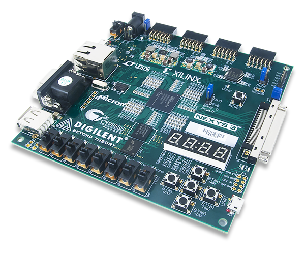

In this repository, you will find a collection of simple VHDL projects.

The projects were developed using [Digilent Adept](https://digilent.com/shop/software/digilent-adept/) and executed on [ Nexys 3 ](https://digilent.com/reference/_media/nexys:nexys3:nexys3_rm.pdf)FPGA development board.

  

## Contents

The repository includes:

- **VHDL Projects**:  VHDL code implementations.
- **Configuration Files**: Digilent Adept configuration files.

## Usage

Feel free to explore the projects and use them as a reference for learning VHDL.
